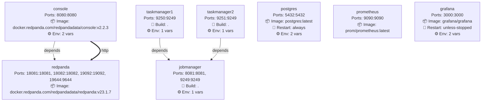
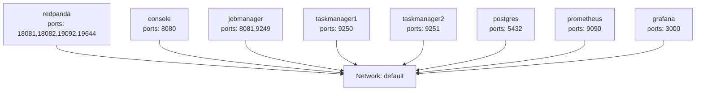
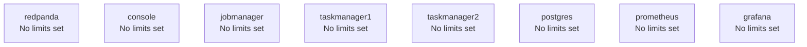

# Docker Compose Service Architecture

## Legend
- **→** Dependency connection (depends_on)
- **⇢** Shared volume connection (bind mounts)
- **⇨** Service-to-service connection (environment variables)
- **💓** Service has healthcheck configured
- **📝** Service has logging configured
- **Red dashed nodes** External services (not in current stack)

# Network Topology

## Network Topology Legend
- **HC** = Healthcheck configured
- **LOG** = Logging configured
- **Blue nodes** = Services with healthcheck
- **Purple nodes** = Services with logging
- **Green nodes** = Services with both healthcheck and logging
- **Dashed lines** = Same service across multiple networks

# Resource Allocation & Volumes

## Resource Limits

## Volume Sharing

## Resource Overview Legend
- **HC** = Healthcheck configured
- **LOG** = Logging configured

# Service Details

## redpanda

**📦 Image:** docker.redpanda.com/redpandadata/redpanda:v23.1.7

**🔌 Ports:** 18081:18081, 18082:18082, 19092:19092, 19644:9644

**🔄 Connected From:**
- **console** via http

**📁 Volumes (1):**
- 🗂️ Bind Mount: `./logs/redpanda` → `/var/lib/redpanda/data`

---

## console

**📦 Image:** docker.redpanda.com/redpandadata/console:v2.2.3

**🔌 Ports:** 8080:8080

**🔗 Dependencies:** redpanda

**🔄 Connects To:**
- **redpanda** via http

**⚙️ Environment Variables (2):**
- `CONFIG_FILEPATH`: /tmp/config.yml
- `CONSOLE_CONFIG_FILE`: kafka:
  brokers: ["redpanda:9092"]
  schemaRegist...

---

## jobmanager

**🔨 Build Context:** .

**🔌 Ports:** 8081:8081, 9249:9249

**⚙️ Environment Variables (1):**
- `FLINK_PROPERTIES`: 
jobmanager.rpc.address: jobmanager
metrics.report...

**📁 Volumes (2):**
- 🗂️ Bind Mount: `./jars/` → `/opt/flink/jars`
- 🗂️ Bind Mount: `./logs/flink/jm` → `/opt/flink/temp`

---

## taskmanager1

**🔨 Build Context:** .

**🔌 Ports:** 9250:9249

**🔗 Dependencies:** jobmanager

**⚙️ Environment Variables (1):**
- `FLINK_PROPERTIES`: 
jobmanager.rpc.address: jobmanager
taskmanager.nu...

**📁 Volumes (1):**
- 🗂️ Bind Mount: `./logs/flink/tm1` → `/opt/flink/temp`

---

## taskmanager2

**🔨 Build Context:** .

**🔌 Ports:** 9251:9249

**🔗 Dependencies:** jobmanager

**⚙️ Environment Variables (1):**
- `FLINK_PROPERTIES`: 
jobmanager.rpc.address: jobmanager
taskmanager.nu...

**📁 Volumes (1):**
- 🗂️ Bind Mount: `./logs/flink/tm2` → `/opt/flink/temp`

---

## postgres

**📦 Image:** postgres:latest

**🔄 Restart Policy:** always

**🔌 Ports:** 5432:5432

**⚙️ Environment Variables (2):**
- `POSTGRES_USER`: postgres
- `POSTGRES_PASSWORD`: postgres

---

## prometheus

**📦 Image:** prom/prometheus:latest

**🔌 Ports:** 9090:9090

**📁 Volumes (1):**
- 🗂️ Bind Mount: `./prometheus` → `/etc/prometheus`

---

## grafana

**📦 Image:** grafana/grafana

**🔄 Restart Policy:** unless-stopped

**🔌 Ports:** 3000:3000

**⚙️ Environment Variables (2):**
- `GF_SECURITY_ADMIN_USER`: grafana
- `GF_SECURITY_ADMIN_PASSWORD`: grafana

**📁 Volumes (2):**
- 🗂️ Bind Mount: `./grafana/provisioning` → `/etc/grafana/provisioning`
- 🗂️ Bind Mount: `./grafana/dashboards` → `/var/lib/grafana/dashboards`

---

# Service Connection Summary

## All Service-to-Service Connections

- **console** → **redpanda** via `http`
